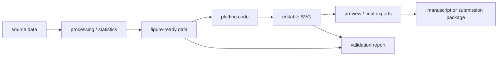

# Reproducible Scientific Figures

`reproducible-scientific-figures` is a Codex skill for building scientific figure workflows from data to editable SVG outputs.

Most AI figure workflows stop at "make a plot." This skill pushes Codex to produce a reproducible figure bundle: figure-ready data, plotting code, editable SVG, optional preview/final exports, and validation notes.



## Why This Exists

Scientific figures are evidence-bearing artifacts. They should not become one-off PNGs with unclear data, hidden filters, missing code, or unverifiable plotted values.

This skill helps Codex keep the figure chain explicit:

```text
source data -> processing/statistics -> figure-ready data -> plotting code -> editable SVG -> preview/final exports -> manuscript or submission package
```

## What It Helps With

- Create a figure-ready data table before plotting.
- Generate reproducible plotting code in the project's preferred language.
- Export editable SVG as the primary working figure.
- Keep preview PNG/JPEG derivatives separate from authority figure assets.
- Validate that outputs, labels, units, panels, and representative values match the figure spec.
- Hand off figures cleanly to Illustrator, Inkscape, PowerPoint, Word, LaTeX, or journal submission workflows.

## What It Does Not Do

- It does not impose one fixed journal style or visual template.
- It does not decide scientific claims without data and project context.
- It does not replace manual scientific review, figure design judgment, or journal-specific requirements.
- It does not treat PNG/JPEG previews as the primary scientific figure artifact.

## Quick Start

Copy the installable skill folder into your Codex skills directory:

```powershell
Copy-Item -Recurse .\reproducible-scientific-figures "$env:USERPROFILE\.codex\skills\"
```

Then ask Codex:

```text
Use reproducible-scientific-figures to create a data-to-SVG pipeline for this CSV.
First create figure-ready data, then plotting code, editable SVG, optional preview exports, and a validation report.
```

## Repository Layout

```text
reproducible-scientific-figures/
  SKILL.md
  agents/
    openai.yaml
  references/
    figure-pipeline.md
    figure-spec-schema.md
    export-bundle.md
    validation-checklist.md
  scripts/
    validate_figure_bundle.py
  examples/
    basic-line-figure/
```

## Validate

Run the skill structure validator:

```powershell
python path\to\skill-creator\scripts\quick_validate.py .\reproducible-scientific-figures
```

Run the example bundle validator:

```powershell
python .\reproducible-scientific-figures\scripts\validate_figure_bundle.py .\reproducible-scientific-figures\examples\basic-line-figure\figure_spec.json
```

The bundle validator is read-only. It checks required fields and file presence. It does not verify scientific correctness.

## Status

This is an initial public version. The safest use is as a workflow guardrail: let Codex build or audit the data-to-SVG chain, then let the researcher review the scientific claim, figure design, and journal-specific export requirements.
